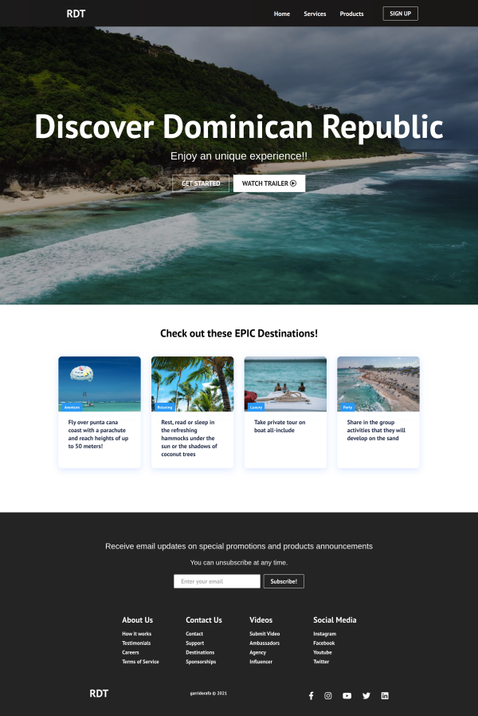

# RDT react website

A sample responsive travel agency website using react, bootstrapped with **Create React App**.



## Demo

[RDT website](https://garridorafa.github.io/rdt-react-website/) (deployed on github pages)

# How to use

Install dependencies

```
npm install
```

Run project on port 3000

```
npm start
```

Build project

```
npm run build
```

Deploy app on github pages

```
npm run deploy
```

# Required

- Docker > 20.10.7
